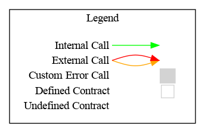

# DocumentEngine  (ERC-1643)

> This project has not been audited yet, please use at your own risk. For any questions, please contact [admin@cmta.ch](mailto:admin@cmta.ch).
>

The `DocumentEngine` is an external contract to manage documents through [*ERC-1643*](https://github.com/ethereum/EIPs/issues/1643), a standard proposition to manage document on-chain. This standard is notably used by [ERC-1400](https://github.com/ethereum/eips/issues/1411) from Polymath. 

The documentEngine is planned to be used by other smart contract,e.g CMTAT token, to store documents on their behalf.

The ERC-1643 defines a document with three attributes:

- A short name (represented as a `bytes32`)
- A generic URI (represented as a `string`) that could point to a website or other document portal.
- The hash of the document contents associated with it on-chain.

A smart contract needs only to read documents from this standard through the interface [IERC1643](./lib/CMTAT/contracts/interfaces/tokenization/draft-IERC1643.sol) to get the documents from the documentEngine. Since CMTAT v3, `getDocument` returns a `Document` struct:

```solidity
interface IERC1643 {
    struct Document {
        string uri;
        bytes32 documentHash;
        uint256 lastModified;
    }

    function getDocument(bytes32 name) external view returns (Document memory document);
    function getAllDocuments() external view returns (bytes32[] memory documentNames_);
    function setDocument(bytes32 name, string calldata uri, bytes32 documentHash) external;
    function removeDocument(bytes32 name) external;
}
```

Using an external contract for your smart contract provides two advantages:

- Reduce code size of your smart contract
- Allow to manage documents for several different smart contracts

### Two ways to manage documents

The engine supports **two management paths** at the same time:

**1. Admin path (`DOCUMENT_MANAGER_ROLE`).** Since the engine manages documents
for several different smart contracts, the admin functions take one supplementary
`address smartContract` argument compared to the ERC-1643:

```solidity
// DocumentEngine (admin overloads)
function setDocument(address smartContract, bytes32 name_, string memory uri_, bytes32 documentHash_) external;
function removeDocument(address smartContract, bytes32 name_) external;
```

**2. Bound-token path (`TOKEN_CONTRACT_ROLE`).** This implements the standard,
single-argument ERC-1643 functions. A token is *bound* to the engine by being
granted `TOKEN_CONTRACT_ROLE` (the same binding pattern as the CMTA
[RuleEngine](https://github.com/CMTA/RuleEngine)):

```solidity
documentEngine.grantRole(TOKEN_CONTRACT_ROLE, address(token));
```

Once bound, the token manages its **own** documents (`msg.sender` is the token);
it can never affect another contract's documents:

```solidity
// DocumentEngine (standard ERC-1643, scoped to msg.sender)
function setDocument(bytes32 name_, string calldata uri_, bytes32 documentHash_) external;
function removeDocument(bytes32 name_) external;
```

### Flexible access control

Following the CMTAT / [RuleEngine](https://github.com/CMTA/RuleEngine) pattern,
the restricted functions do not hardcode a role check. They carry a **modifier**
(`onlyDocumentManager` / `onlyBoundToken`) that delegates to an **overridable
`internal virtual` authorization hook**:

```solidity
function _authorizeDocumentManagement() internal view virtual {
    _checkRole(DOCUMENT_MANAGER_ROLE);
}

function _authorizeBoundTokenDocumentManagement() internal view virtual {
    _checkRole(TOKEN_CONTRACT_ROLE);
}
```

This separates the document-management implementation from the authorization
logic: a subclass can override a hook to change *who* is authorized (e.g. a
different role, an allowlist, or open access) without touching the management
functions. The default behavior is the role checks shown above.

### Events

On every write, the engine emits the standard `IERC1643` events **and** the
optional `DocumentUpdatedForContract` / `DocumentRemovedForContract` events,
which additionally carry the `smartContract` (token) address so off-chain
indexers can tell which contract a document belongs to during multi-contract
operations. See [ERC-1643-proposition.md](./ERC-1643-proposition.md) for the
proposed optional standard extension.

### Integration with CMTAT

Since CMTAT v3, the shipped standalone tokens store documents on-chain
(`DocumentERC1643Module`) and do not consume an external engine through their
constructor. To use this engine, a CMTAT token relies on the
`DocumentEngineModule` and is wired at runtime with `setDocumentEngine(engine)`;
reads/writes are then forwarded to the engine keyed by the token address.


## Schema

### Inheritance


### Graph




## Surya Description Report

### Contracts Description Table

|      Contract      |         Type         |                      Bases                       |                |               |
| :----------------: | :------------------: | :----------------------------------------------: | :------------: | :-----------: |
|         └          |  **Function Name**   |                  **Visibility**                  | **Mutability** | **Modifiers** |
|                    |                      |                                                  |                |               |
| **DocumentEngine** |    Implementation    | IERC1643, DocumentEngineInvariant, AccessControl, ERC2771Context |                |               |
|         └          |    <Constructor>     |                     Public ❗️                     |       🛑        |      NO❗️      |
|         └          |     setDocument      |                     Public ❗️                     |       🛑        |   onlyDocumentManager    |
|         └          |    removeDocument    |                    External ❗️                    |       🛑        |   onlyDocumentManager    |
|         └          |     setDocument      |                    External ❗️                    |       🛑        |   onlyBoundToken    |
|         └          |    removeDocument    |                    External ❗️                    |       🛑        |   onlyBoundToken    |
|         └          |  batchSetDocuments   |                    External ❗️                    |       🛑        |   onlyDocumentManager    |
|         └          |  batchSetDocuments   |                    External ❗️                    |       🛑        |   onlyDocumentManager    |
|         └          | batchRemoveDocuments |                    External ❗️                    |       🛑        |   onlyDocumentManager    |
|         └          | batchRemoveDocuments |                    External ❗️                    |       🛑        |   onlyDocumentManager    |
|         └          |     getDocument      |                    External ❗️                    |                |      NO❗️      |
|         └          |     getDocument      |                    External ❗️                    |                |      NO❗️      |
|         └          |   getAllDocuments    |                    External ❗️                    |                |      NO❗️      |
|         └          |   getAllDocuments    |                    External ❗️                    |                |      NO❗️      |
|         └          |       hasRole        |                     Public ❗️                     |                |      NO❗️      |
|         └          |     _getDocument     |                    Internal 🔒                    |                |               |
|         └          | _removeDocumentName  |                    Internal 🔒                    |       🛑        |               |
|         └          |   _removeDocument    |                    Internal 🔒                    |       🛑        |               |
|         └          |     _setDocument     |                    Internal 🔒                    |       🛑        |               |


### Legend

| Symbol | Meaning                   |
| :----: | ------------------------- |
|   🛑    | Function can modify state |
|   💵    | Function is payable       |


## Gasless support (ERC-2771)

The DocumentEngine supports client-side gasless transactions using the [Gas Station Network](https://docs.opengsn.org/#the-problem) (GSN) pattern, the main open standard for transfering fee payment to another account than that of the transaction issuer. The contract uses the OpenZeppelin contract `ERC2771ContextUpgradeable`, which allows a contract to get the original client with `_msgSender()` instead of the fee payer given by `msg.sender` while allowing upgrades on the main contract (see *Deployment via a proxy* above).

At deployment, the parameter  `forwarder` inside the constructor has to be set  with the defined address of the forwarder. Please note that the forwarder can not be changed after deployment.

Please see the OpenGSN [documentation](https://docs.opengsn.org/contracts/#receiving-a-relayed-call) for more details on what is done to support GSN in the contract.


## Dependencies

The toolchain includes the following components, where the versions are the latest ones that we tested:

- Foundry
- Solidity 0.8.34 (via solc-js), `evm_version = prague`
- OpenZeppelin Contracts (submodule) [v5.6.1](https://github.com/OpenZeppelin/openzeppelin-contracts/releases/tag/v5.6.1)
- Tests
  - [CMTAT v3.3.0-rc1](https://github.com/CMTA/CMTAT/releases/tag/v3.3.0-rc1)
  - [RuleEngine v2.1.0](https://github.com/CMTA/RuleEngine/releases/tag/v2.1.0) (binding-role reference)
  - OpenZeppelin Contracts Upgradeable (submodule) [v5.6.1](https://github.com/OpenZeppelin/openzeppelin-contracts-upgradeable/releases/tag/v5.6.1)

## Tools

### Prettier

```bash
npx prettier --write --plugin=prettier-plugin-solidity 'src/**/*.sol'
```

### Slither

```bash
slither .  --checklist --filter-paths "openzeppelin-contracts|test|CMTAT|forge-std" > slither-report.md
```

### Surya

See [./doc/script](./doc/script)

### Foundry

Foundry is a blazing fast, portable and modular toolkit for Ethereum application development written in Rust.

Foundry consists of:

-   **Forge**: Ethereum testing framework (like Truffle, Hardhat and DappTools).
-   **Cast**: Swiss army knife for interacting with EVM smart contracts, sending transactions and getting chain data.
-   **Anvil**: Local Ethereum node, akin to Ganache, Hardhat Network.
-   **Chisel**: Fast, utilitarian, and verbose solidity REPL.

#### Documentation

https://book.getfoundry.sh/

#### Usage

##### Coverage

```bash
$ forge coverage --report lcov && genhtml lcov.info --branch-coverage --output-dir coverage
```

##### Gas report

```bash
$ forge test --gas-report
```

##### Build

```shell
$ forge build
```

##### Test

```shell
$ forge test
```

##### Format

```shell
$ forge fmt
```

##### Gas Snapshots

```shell
$ forge snapshot
```

##### Anvil

```shell
$ anvil
```

##### Deploy

```shell
$ forge script script/Counter.s.sol:CounterScript --rpc-url <your_rpc_url> --private-key <your_private_key>
```

##### Cast

```shell
$ cast <subcommand>
```

##### Help

```shell
$ forge --help
$ anvil --help
$ cast --help
```

## Intellectual property

The code is copyright (c) Capital Market and Technology Association, 2018-2024, and is released under [Mozilla Public License 2.0](https://github.com/CMTA/CMTAT/blob/master/LICENSE.md).
