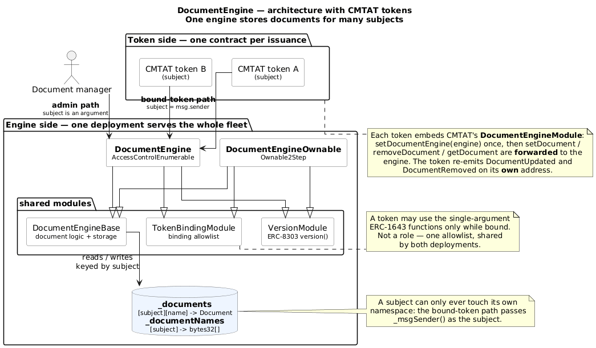
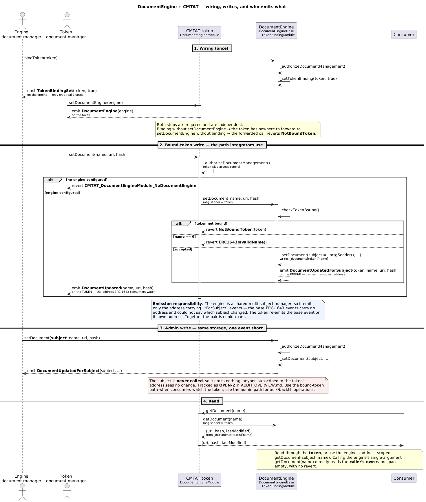
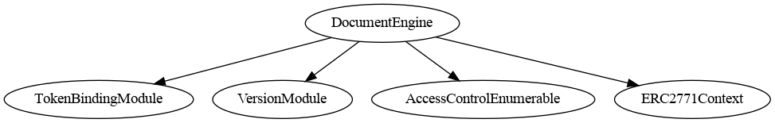
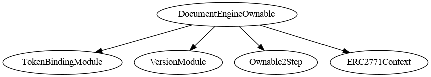
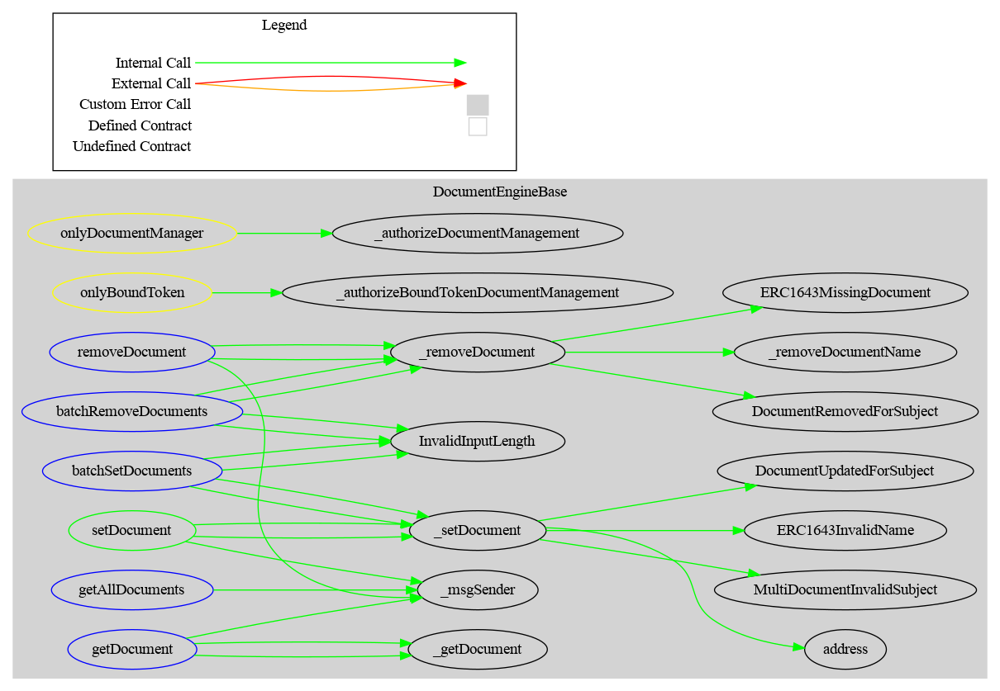
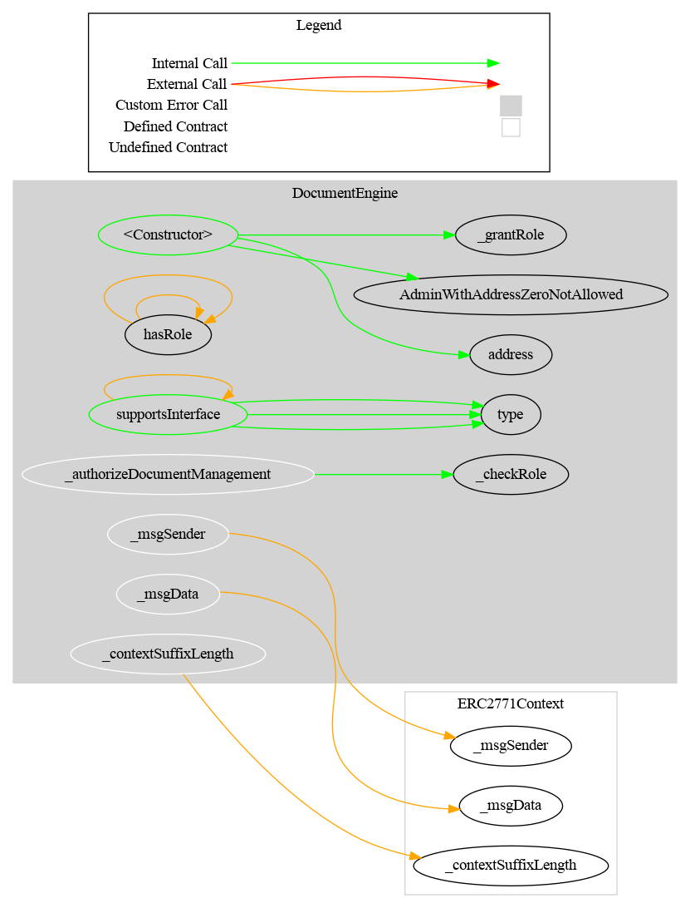
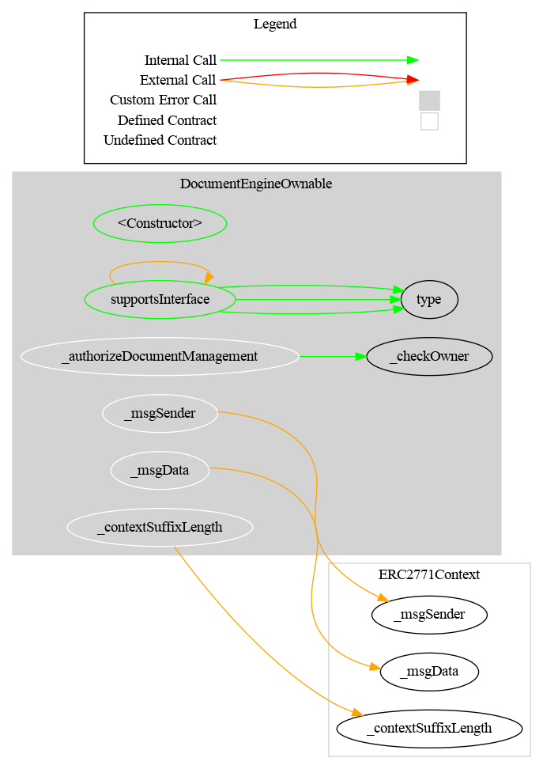

# DocumentEngine  (ERC-1643)

> This project has not been audited yet, please use at your own risk. For any questions, please contact [admin@cmta.ch](mailto:admin@cmta.ch).

The `DocumentEngine` is an external contract to manage documents through [*ERC-1643*](https://github.com/ethereum/EIPs/issues/1643), a standard proposition to manage document on-chain. This standard is notably used by [ERC-1400](https://github.com/ethereum/eips/issues/1411) from Polymath. 

The documentEngine is planned to be used by other smart contract,e.g CMTAT token, to store documents on their behalf.

The ERC-1643 defines a document with three attributes:

- A short name (represented as a `bytes32`)
- A generic URI (represented as a `string`) that could point to a website or other document portal.
- The hash of the document contents associated with it on-chain.

A smart contract needs only to read documents from this standard through the interface [IERC1643](./lib/CMTAT/contracts/interfaces/tokenization/draft-IERC1643.sol) to get the documents from the documentEngine:

```solidity
interface IERC1643 {
    error ERC1643InvalidName();
    error ERC1643MissingDocument();

    function getDocument(bytes32 name)
        external
        view
        returns (string memory uri, bytes32 documentHash, uint256 lastModified);
    function getAllDocuments() external view returns (bytes32[] memory documentNames_);
    function setDocument(bytes32 name, string calldata uri, bytes32 documentHash) external;
    function removeDocument(bytes32 name) external;
}
```

> **Note — `getDocument` returns flat values.** CMTAT `v3.3.0-rc1` briefly returned a `Document`
> struct here; `v3.3.0-rc2` restored the three flat return values mandated by the ERC-1643 ABI, and
> this engine follows. The distinction matters because return types are not part of a function
> signature: both shapes have the same selector and the same `type(IERC1643).interfaceId`, so a
> struct return is undetectable through ERC-165 and a consumer built from the specification ABI
> would silently decode it as garbage. The `Document` struct is kept internally for storage only.
> `testGetDocumentReturnsFlatErc1643Abi` pins the wire format.

Using an external contract for your smart contract provides two advantages:

- Reduce code size of your smart contract
- Allow to manage documents for several different smart contracts

### Two ways to manage documents

The engine supports **two management paths** at the same time:

**1. Admin path (`DOCUMENT_MANAGER_ROLE`).** Since the engine manages documents
for several different smart contracts, the admin functions take one supplementary
`address smartContract` argument compared to the ERC-1643:

```solidity
// DocumentEngine (admin overloads)
function setDocument(address smartContract, bytes32 name_, string memory uri_, bytes32 documentHash_) external;
function removeDocument(address smartContract, bytes32 name_) external;
```

**2. Bound-token path.** This implements the standard, single-argument ERC-1643
functions. A token is *bound* to the engine through the shared **`ITokenBinding`**
surface — identical across both deployments, so integrators bind/query a token the
same way regardless of the access-control model:

```solidity
documentEngine.bindToken(address(token));    // also: unbindToken(token), isTokenBound(token)
```

Both deployments share the exact same binding mechanism — a single allowlist in
`TokenBindingModule` (`src/modules/TokenBindingModule.sol`), **not** a role. They
expose the same `bindToken` / `unbindToken` / `isTokenBound` functions, emit the
same `TokenBindingSet` event, and revert with the same `NotBoundToken` error when a
non-bound caller attempts a write. The only difference is *who* may bind: whoever
may manage documents in that deployment (the `DOCUMENT_MANAGER_ROLE` holder, or the
`owner`), since binding is authorized by the same document-management hook.

Once bound, the token manages its **own** documents (`msg.sender` is the token);
it can never affect another contract's documents:

```solidity
// DocumentEngine (standard ERC-1643, scoped to msg.sender)
function setDocument(bytes32 name_, string calldata uri_, bytes32 documentHash_) external;
function removeDocument(bytes32 name_) external;
```

> This mirrors the RuleEngine *binding* pattern without reusing its
> `ERC3643ComplianceExtendedModule` — see
> [Why not reuse RuleEngine's ERC-3643 compliance module?](#why-not-reuse-ruleengines-erc-3643-compliance-module) below.

### Flexible access control

Following the CMTAT / [RuleEngine](https://github.com/CMTA/RuleEngine) pattern,
the restricted functions do not hardcode a check. They carry a **modifier**
(`onlyDocumentManager` / `onlyBoundToken`) that delegates to an **overridable
`internal virtual` authorization hook**:

- the **admin path** delegates to `_authorizeDocumentManagement()`, the one hook
  each deployment implements (`_checkRole(DOCUMENT_MANAGER_ROLE)` for
  `DocumentEngine`, `_checkOwner()` for `DocumentEngineOwnable`);
- the **bound-token path** delegates to `_authorizeBoundTokenDocumentManagement()`,
  which `TokenBindingModule` implements once for both deployments (it checks the
  shared binding allowlist).

```solidity
// implemented per deployment (the only access-control hook they supply)
function _authorizeDocumentManagement() internal view virtual {
    _checkRole(DOCUMENT_MANAGER_ROLE); // or _checkOwner()
}

// implemented once in TokenBindingModule for both deployments
function _authorizeBoundTokenDocumentManagement() internal view virtual override {
    _checkTokenBound(); // reverts NotBoundToken if msg.sender is not bound
}
```

This separates the document-management implementation from the authorization
logic: a subclass changes *who* is authorized by overriding the hook, never by
touching the management functions.

### Why not reuse RuleEngine's ERC-3643 compliance module?

CMTA's [RuleEngine](https://github.com/CMTA/RuleEngine) (v3) ships an
`ERC3643ComplianceExtendedModule` that offers a ready-made token-binding registry
(`bindToken` / `unbindToken` / `isTokenBound` / `getTokenBounds`). It is tempting
to reuse it for the bound-token path, but we deliberately do **not**, because that
module is an **`IERC3643Compliance`** — a *transfer-compliance* contract.

Inheriting it would force the DocumentEngine to also implement the ERC-3643
transfer-compliance callbacks that come with that interface:

```solidity
function canTransfer(address, address, uint256) external view returns (bool);
function transferred(address, address, uint256) external;
function created(address, uint256) external;
function destroyed(address, uint256) external;
```

A document engine has **nothing to do with token transfers**, so these would have
to be stubbed as no-ops (`canTransfer` always returning `true`). That is
misleading: the contract would advertise a transfer-compliance surface it does
not honor, enlarging the ABI and inviting integrators to wire it where a real
compliance contract is expected.

The binding concept we actually need is tiny — "is this caller a token allowed to
manage its own documents?" — so we implement just that: a **single allowlist** in
`TokenBindingModule`, shared by both deployments and gated by each one's
document-management hook. It is deliberately **not** a role: there is no
`TOKEN_CONTRACT_ROLE`, and `DocumentEngineOwnable` uses the same allowlist rather
than a separate owner-managed one. This keeps the engine's surface honest and
minimal while still mirroring the RuleEngine binding pattern; the RuleEngine
submodule is kept as a reference for that pattern.

### Events

This engine is a **shared, multi-token** document manager, so — per the ERC-1643
["Emission Responsibility"](./doc/ERCSpecification/erc-1643.md) rules — it emits
**only** the address-carrying extension events
`DocumentUpdatedForSubject(address indexed subject, …)` /
`DocumentRemovedForSubject(…)`, and **not** the base `DocumentUpdated` /
`DocumentRemoved` events. The base events carry no address and so cannot identify
which token contract a change belongs to; they are the responsibility of the
token contract that exposes ERC-1643 to consumers (it re-emits them when
delegating). See
the [Multi-Subject Document Management draft](./doc/ERCSpecification/erc-draft_multi_document_management.md)
and the `IERC1643MultiDocument` extension.

### Integration with CMTAT

Since CMTAT v3, the shipped standalone tokens store documents on-chain
(`DocumentERC1643Module`) and do not consume an external engine through their
constructor. To use this engine, a CMTAT token relies on the
`DocumentEngineModule` and is wired at runtime with `setDocumentEngine(engine)`;
reads/writes are then forwarded to the engine keyed by the token address.

#### Architecture

One engine serves a whole fleet of tokens. Each token keeps its own document
namespace, keyed by its address, and can never reach another token's:



_Diagram source: `doc/img/cmtat-integration-architecture.puml`._

#### Wiring and call flow

Two independent steps wire a token to the engine, and they are easy to get half
right: `bindToken(token)` on the **engine** authorises the token to use the
single-argument ERC-1643 functions, while `setDocumentEngine(engine)` on the
**token** tells it where to forward. Bind without wiring and the token has
nowhere to send; wire without binding and the forwarded call reverts
`NotBoundToken`.

The diagram below also shows the emission split that makes the pair conformant —
and the one case where it does not hold, the admin path:



_Diagram source: `doc/img/cmtat-integration-sequence.puml`._

A minimal integration:

```solidity
// 1. authorise the token on the engine (engine's document manager)
documentEngine.bindToken(address(token));

// 2. point the token at the engine (token's document manager)
token.setDocumentEngine(documentEngine);

// 3. the token now manages its own documents through the standard ERC-1643 calls,
//    and reads are forwarded to the engine keyed by the token address
token.setDocument(bytes32("prospectus"), "ipfs://...", keccak256(bytes(content)));
```

Both halves are covered by the test suite against real CMTAT code:
`testCanReturnCMTATDocument` wires `CMTATDocumentEngineMock` (built on CMTAT's
`DocumentEngineModule`) with `setDocumentEngine` and reads through it, and
`testBoundTokenCanManageOwnDocument` exercises the bound-token write and the
namespace isolation that goes with it.


## Architecture

The engine is split into two contracts (CMTAT module/deployment pattern):

- **`DocumentEngineBase`** (abstract) — holds the document storage and all the
  ERC-1643 document-management functions, plus the `onlyDocumentManager` /
  `onlyBoundToken` modifiers and the **abstract** `_authorize*` hooks. It is
  agnostic to the access-control implementation.
- **`DocumentEngine`** (deployment) — the concrete, deployable contract. It
  defines the **access control** (`AccessControlEnumerable`, the `_authorize*`
  hook implementations and the `hasRole` override) and wires the ERC-2771
  (gasless) support. `AccessControlEnumerable` additionally allows enumerating
  the members of each role on-chain.
- **`DocumentEngineOwnable`** (alternative deployment) — same base logic, but
  access control is a single **owner** via `Ownable2Step` (two-step ownership
  transfer) instead of roles. Both document management and token binding are
  `owner`-only.
- **`TokenBindingModule`** (`src/modules/TokenBindingModule.sol`) — the shared
  token-binding registry (an allowlist) implementing `ITokenBinding`
  (`bindToken` / `unbindToken` / `isTokenBound` + `TokenBindingSet`). Both
  deployments inherit it, so binding is identical (same functions, event, and
  `NotBoundToken` revert) and ERC-165-discoverable regardless of the
  access-control model; binding is authorized by each deployment's
  document-management hook.

`DocumentEngineInvariant` provides the errors shared by every deployment.
Access-control specifics are **not** defined there: the `DOCUMENT_MANAGER_ROLE`
constant lives in the role-based `DocumentEngine`, and the owner logic in
`DocumentEngineOwnable`.

`VersionModule` (`src/modules/VersionModule.sol`) isolates the version concern
and implements [ERC-8303](https://ethereum-magicians.org/t/erc-8303-contract-version/28795)
(see below).

## Version (ERC-8303)

The contract version is exposed through the `VersionModule`, which implements
the [ERC-8303](https://ethereum-magicians.org/t/erc-8303-contract-version/28795)
`IERC8303` interface:

```solidity
interface IERC8303 {
    function version() external view returns (string memory);
}
```

- `version()` returns the current version string (e.g. `"0.4.0"`), following
  Semantic Versioning 2.0.0.
- The public `VERSION` constant is kept for backward compatibility and returns
  the same value.
- ERC-165 discovery is supported: `supportsInterface(0x54fd4d50)` (the ERC-8303
  interface id) returns `true`.

### ERC-165: what the engine advertises

Both deployments advertise:

| Interface | Id | |
| --- | --- | --- |
| `IERC1643` | `0xecfecec8` | base single-argument functions, for a **bound subject** |
| `IERC1643MultiDocument` | `0xa2b1179b` | address-scoped document management |
| `ITokenBinding` | — | `bindToken` / `unbindToken` / `isTokenBound` |
| `IERC8303` | `0x54fd4d50` | `version()` |
| `IERC165` | `0x01ffc9a7` | |
| `IAccessControlEnumerable` | — | `DocumentEngine` only |

`type(IERC1643).interfaceId` is advertised because the engine really does implement the base
single-argument functions. Its audience is a **token wiring itself to the engine**: before calling
`setDocumentEngine(engine)`, or before forwarding `setDocument(name, uri, hash)`, a token can confirm
through ERC-165 that those endpoints exist here rather than discovering it from a failed call.
`ITokenBinding` answers the complementary question — does this engine have a binding surface — and
`isTokenBound(address(this))` whether that particular token may use it.

> **It is not an invitation to read documents from this address.** The base functions are
> `_msgSender()`-scoped, so a third party calling `getDocument(name)` on the engine reads *its own*,
> empty namespace — no revert, no error, just nothing — and the engine emits only the
> address-carrying `*ForSubject` events. Point document consumers at the **subject**, or use the
> address-scoped `getDocument(subject, name)`. Asserted by
> `testBaseERC1643IsAdvertisedButReadsAreCallerScoped`.

## Schema

Generated with Surya — regenerate with the three scripts in [`doc/script`](./doc/script). Diagrams
for **every** file in `src/`, interfaces included, live under [`doc/surya`](./doc/surya); the ones
below are the two deployments and the base they share.

### Inheritance

Both deployments sit on the same two modules — `DocumentEngineBase` (document logic) and
`TokenBindingModule` (the binding allowlist) — and differ only in the access-control layer.

#### `DocumentEngine` — role-based (`AccessControlEnumerable`)



#### `DocumentEngineOwnable` — single owner (`Ownable2Step`)



### Graph

#### `DocumentEngineBase` — the shared document logic



#### `DocumentEngine`



#### `DocumentEngineOwnable`



## Surya Description Report

### Contracts Description Table

Per-file reports live in [`doc/surya/surya_report`](./doc/surya/surya_report); the tables below merge
them. Note that the document functions belong to **`DocumentEngineBase`**, not to either deployment —
each deployment contributes only its access-control layer and its ERC-2771 context overrides.

|  Contract  |         Type        |       Bases      |                  |                 |
|:----------:|:-------------------:|:----------------:|:----------------:|:---------------:|
|     └      |  **Function Name**  |  **Visibility**  |  **Mutability**  |  **Modifiers**  |
||||||
| **DocumentEngineBase** | Implementation | IERC1643, IERC1643MultiDocument, DocumentEngineInvariant, Context |||
| └ | removeDocument | External ❗️ | 🛑  | onlyDocumentManager |
| └ | setDocument | External ❗️ | 🛑  | onlyBoundToken |
| └ | removeDocument | External ❗️ | 🛑  | onlyBoundToken |
| └ | batchSetDocuments | External ❗️ | 🛑  | onlyDocumentManager |
| └ | batchSetDocuments | External ❗️ | 🛑  | onlyDocumentManager |
| └ | batchRemoveDocuments | External ❗️ | 🛑  | onlyDocumentManager |
| └ | batchRemoveDocuments | External ❗️ | 🛑  | onlyDocumentManager |
| └ | getDocument | External ❗️ |   |NO❗️ |
| └ | getDocument | External ❗️ |   |NO❗️ |
| └ | getAllDocuments | External ❗️ |   |NO❗️ |
| └ | getAllDocuments | External ❗️ |   |NO❗️ |
| └ | setDocument | Public ❗️ | 🛑  | onlyDocumentManager |
| └ | _removeDocumentName | Internal 🔒 | 🛑  | |
| └ | _removeDocument | Internal 🔒 | 🛑  | |
| └ | _setDocument | Internal 🔒 | 🛑  | |
| └ | _authorizeDocumentManagement | Internal 🔒 |   | |
| └ | _authorizeBoundTokenDocumentManagement | Internal 🔒 |   | |
| └ | _getDocument | Internal 🔒 |   | |
||||||
| **DocumentEngine** | Implementation | TokenBindingModule, VersionModule, AccessControlEnumerable, ERC2771Context |||
| └ | <Constructor> | Public ❗️ | 🛑  | ERC2771Context |
| └ | hasRole | Public ❗️ |   |NO❗️ |
| └ | supportsInterface | Public ❗️ |   |NO❗️ |
| └ | _authorizeDocumentManagement | Internal 🔒 |   | |
| └ | _msgSender | Internal 🔒 |   | |
| └ | _msgData | Internal 🔒 |   | |
| └ | _contextSuffixLength | Internal 🔒 |   | |
||||||
| **DocumentEngineOwnable** | Implementation | TokenBindingModule, VersionModule, Ownable2Step, ERC2771Context |||
| └ | <Constructor> | Public ❗️ | 🛑  | Ownable ERC2771Context |
| └ | supportsInterface | Public ❗️ |   |NO❗️ |
| └ | _authorizeDocumentManagement | Internal 🔒 |   | |
| └ | _msgSender | Internal 🔒 |   | |
| └ | _msgData | Internal 🔒 |   | |
| └ | _contextSuffixLength | Internal 🔒 |   | |
||||||
| **TokenBindingModule** | Implementation | DocumentEngineBase, ITokenBinding |||
| └ | bindToken | External ❗️ | 🛑  |NO❗️ |
| └ | unbindToken | External ❗️ | 🛑  |NO❗️ |
| └ | isTokenBound | Public ❗️ |   |NO❗️ |
| └ | _setTokenBinding | Internal 🔒 | 🛑  | |
| └ | _authorizeBoundTokenDocumentManagement | Internal 🔒 |   | |
| └ | _checkTokenBound | Internal 🔒 |   | |
||||||
| **VersionModule** | Implementation | IERC8303, ERC165 |||
| └ | version | Public ❗️ |   |NO❗️ |
| └ | supportsInterface | Public ❗️ |   |NO❗️ |
||||||
| **DocumentEngineInvariant** | Implementation |  |||

### Interfaces

|  Contract  |         Type        |       Bases      |                  |                 |
|:----------:|:-------------------:|:----------------:|:----------------:|:---------------:|
|     └      |  **Function Name**  |  **Visibility**  |  **Mutability**  |  **Modifiers**  |
||||||
| **IERC1643MultiDocument** | Interface |  |||
| └ | setDocument | External ❗️ | 🛑  |NO❗️ |
| └ | removeDocument | External ❗️ | 🛑  |NO❗️ |
| └ | getDocument | External ❗️ |   |NO❗️ |
| └ | getAllDocuments | External ❗️ |   |NO❗️ |
||||||
| **ITokenBinding** | Interface |  |||
| └ | bindToken | External ❗️ | 🛑  |NO❗️ |
| └ | unbindToken | External ❗️ | 🛑  |NO❗️ |
| └ | isTokenBound | External ❗️ |   |NO❗️ |
||||||
| **IERC8303** | Interface |  |||
| └ | version | External ❗️ |   |NO❗️ |


### Legend

| Symbol | Meaning                   |
| :----: | ------------------------- |
|   🛑    | Function can modify state |
|   💵    | Function is payable       |


## Gasless support (ERC-2771)

The DocumentEngine supports client-side gasless transactions using the [Gas Station Network](https://docs.opengsn.org/#the-problem) (GSN) pattern, the main open standard for transfering fee payment to another account than that of the transaction issuer. The contract uses the OpenZeppelin contract `ERC2771ContextUpgradeable`, which allows a contract to get the original client with `_msgSender()` instead of the fee payer given by `msg.sender` while allowing upgrades on the main contract (see *Deployment via a proxy* above).

At deployment, the parameter  `forwarder` inside the constructor has to be set  with the defined address of the forwarder. Please note that the forwarder can not be changed after deployment.

Please see the OpenGSN [documentation](https://docs.opengsn.org/contracts/#receiving-a-relayed-call) for more details on what is done to support GSN in the contract.


## Dependencies

The toolchain includes the following components, where the versions are the latest ones that we tested:

- Foundry
- Solidity 0.8.34 (via solc-js), `evm_version = prague`
- OpenZeppelin Contracts (submodule) [v5.7.0](https://github.com/OpenZeppelin/openzeppelin-contracts/releases/tag/v5.7.0)
- Tests
  - [CMTAT v3.3.0-rc3](https://github.com/CMTA/CMTAT/releases/tag/v3.3.0-rc3)
  - [RuleEngine v3.0.0-rc5](https://github.com/CMTA/RuleEngine/releases/tag/v3.0.0-rc5) (binding-pattern reference only — its compliance module is [not reused](#why-not-reuse-ruleengines-erc-3643-compliance-module))
  - OpenZeppelin Contracts Upgradeable (submodule) [v5.7.0](https://github.com/OpenZeppelin/openzeppelin-contracts-upgradeable/releases/tag/v5.7.0)

### Version compatibility

Each release of this engine is built and tested against one CMTAT release. CMTAT's `IERC1643` is
not stable across its own release candidates, so pairing a version of this engine with a different
CMTAT than the one below is not supported.

| DocumentEngine | CMTAT | Solidity / `evm_version` | OpenZeppelin | `getDocument` returns |
| -------------- | ----- | ------------------------ | ------------ | --------------------- |
| **v0.4.0** (current) | [v3.3.0-rc3](https://github.com/CMTA/CMTAT/releases/tag/v3.3.0-rc3) | `0.8.34` / `prague` | v5.7.0 | `(string, bytes32, uint256)` |
| v0.3.0 | [v2.5.0-rc0](https://github.com/CMTA/CMTAT/releases/tag/v2.5.0-rc0) | `0.8.26` / `cancun` | v5.0.2 | `(string, bytes32, uint256)` |
| v0.2.0 | [v2.5.0-rc0](https://github.com/CMTA/CMTAT/releases/tag/v2.5.0-rc0) | `0.8.26` / `cancun` | v5.0.2 | `(string, bytes32, uint256)` |
| v0.1.0 | [v2.5.0-rc0](https://github.com/CMTA/CMTAT/releases/tag/v2.5.0-rc0) | `0.8.26` / `cancun` | v5.0.2 | `(string, bytes32, uint256)` |

Notes on the CMTAT v2 → v3 jump at `v0.4.0`:

- **CMTAT `v3.3.0-rc1` is not supported.** It is the one release in which `IERC1643.getDocument`
  returns a `Document` struct rather than the three flat values; `v3.3.0-rc2` reverted that and
  `v3.3.0-rc3` keeps the flat return. rc1 also does not declare `ERC1643InvalidName` /
  `ERC1643MissingDocument` on the interface. Building this engine against rc1 fails to compile.
- **`v3.3.0-rc2` → `v3.3.0-rc3` is a no-op for this engine.** The only change to the document
  surface (`draft-IERC1643.sol`, `IDocumentEngine.sol`, `DocumentEngineModule.sol`,
  `DocumentERC1643Module.sol`) is a pragma bump from `^0.8.20` to `^0.8.24`; the interface, the
  errors and the `getDocument` return shape are unchanged.
- The `IERC1643` import path moved in CMTAT v3, from
  `CMTAT/interfaces/engine/draft-IERC1643.sol` to `CMTAT/interfaces/tokenization/draft-IERC1643.sol`.
- Document names became `bytes32` in CMTAT v3 (they were `string` up to v2.5.0-rc0).
- Two different Solidity floors apply from `v0.4.0` on, and the sources declare the lower of them:
  - **`src/` requires `≥ 0.8.24`** — the pragma every file declares. OpenZeppelin's
    `AccessControlEnumerable.sol` / `EnumerableSet.sol` and, since CMTAT `v3.3.0-rc3`,
    `draft-IERC1643.sol` are all `^0.8.24`, so no contract here compiles below it.
  - **Building the full project, tests included, requires `≥ 0.8.27`**, because CMTAT v3 uses
    `require(cond, CustomError())`, which is restricted to the via-ir pipeline before `0.8.27`.

  This is why the declared pragma is `^0.8.24` while `foundry.toml` pins `0.8.34`.

Exact submodule revisions are pinned in [`foundry.lock`](./foundry.lock).

## Tools

### Formatting (forge fmt)

`forge fmt` is the canonical formatter for this project (configured under `[fmt]`
in `foundry.toml`):

```bash
forge fmt          # format src/, test/, script/
forge fmt --check  # verify formatting (CI)
```

### Static analysis

Reports are versioned under [`doc/audits/tools/`](./doc/audits/tools), one directory per release,
each with the raw tool output (prefixed by a summary table) and a feedback file triaging every
finding against the source. The security overview is
[`doc/audits/AUDIT_OVERVIEW.md`](./doc/audits/AUDIT_OVERVIEW.md).

| Release | Tool | Result | Report | Triage |
| ------- | ---- | ------ | ------ | ------ |
| v0.4.0 | Aderyn `0.6.5` | 0 High · 6 Low — **nothing to fix** | [report](./doc/audits/tools/v0.4.0/aderyn/aderyn-report.md) | [feedback](./doc/audits/tools/v0.4.0/aderyn/aderyn-report-feedback.md) |
| v0.4.0 | Slither `0.11.5` | 0 High · 0 Medium · 0 Low · 2 Info — **nothing to fix** | [report](./doc/audits/tools/v0.4.0/slither/slither-report.md) | [feedback](./doc/audits/tools/v0.4.0/slither/slither-report-feedback.md) |
| v0.4.0 | Claude Code (code quality) | 14 findings, **no vulnerability** — 6 implemented, 8 deliberately left | [report](./doc/audits/tools/v0.4.0/claude/CLAUDE_ANALYSIS.md) | (triage is in the report) |

```bash
# Aderyn — mocks excluded (this project's mocks live in test/, which Aderyn does not scan)
aderyn -x mocks --output doc/audits/tools/v0.4.0/aderyn/aderyn-report.md

# Slither — mocks excluded (they live in test/, removed by the `test` filter)
slither . --checklist --filter-paths "node_modules,lib,test,forge-std,mocks" \
  > doc/audits/tools/v0.4.0/slither/slither-report.md
```

> **Filter on `lib`, not on individual submodule names.** This is a Foundry project, so every
> dependency lives under `lib/`. `--filter-paths` fails *open* — an entry matching nothing silently
> widens scope instead of erroring — so naming submodules one by one risks pulling a whole vendored
> tree into the report. Verify with `grep -c 'lib/\|node_modules/' <report>`, which must return `0`.
> Slither also writes its checklist to **stdout** and its detector log to **stderr**, and exits
> non-zero when it finds anything: `exit=255` with a populated report is the normal outcome.

> **Static-analysis output is leads, not findings.** Every dismissal in the feedback files was
> verified against the cited `file:line`, and neither tool can see the specification-level issues
> that matter most here — those are tracked under *Known open items* in
> [`AUDIT_OVERVIEW.md`](./doc/audits/AUDIT_OVERVIEW.md).

### Surya

Three scripts in [`doc/script`](./doc/script) regenerate the diagrams and reports for every `.sol`
under `src/`, writing into a scratch `docOut/` at the repo root. **Run them from `doc/script/` and in
this order** — the graph script creates `docOut/`, and the report script's `mkdir` has no `-p`:

```bash
(cd doc/script && bash script_surya_graph.sh)
(cd doc/script && bash script_surya_inheritance.sh)
(cd doc/script && bash script_surya_report.sh)
```

Then replace the three directories under [`doc/surya`](./doc/surya) with the fresh output. Requires
Graphviz (`dot`) — the graph and inheritance scripts pipe through it.

> **Known Surya bug — check for 0-byte PNGs.** `surya graph` parses only the file it is given, so a
> `super.<fn>()` call into a base declared elsewhere throws
> `TypeError: Cannot read properties of undefined (reading 'includes')`. Piped into `dot`, that
> surfaces as a silent **empty PNG**, not an error. Four files here call `super.<fn>()`
> (`DocumentEngine`, `DocumentEngineOwnable`, `VersionModule`, `TokenBindingModule`), so the guard in
> `surya/lib/graph.js` — `functionsPerContract[contract] && functionsPerContract[contract].includes(name)`
> — must be applied before regenerating. It lives in `node_modules` (or the `npx` cache) and is
> reverted by any reinstall.

### Foundry

Foundry is a blazing fast, portable and modular toolkit for Ethereum application development written in Rust.

Foundry consists of:

-   **Forge**: Ethereum testing framework (like Truffle, Hardhat and DappTools).
-   **Cast**: Swiss army knife for interacting with EVM smart contracts, sending transactions and getting chain data.
-   **Anvil**: Local Ethereum node, akin to Ganache, Hardhat Network.
-   **Chisel**: Fast, utilitarian, and verbose solidity REPL.

#### Documentation

https://book.getfoundry.sh/

#### Usage

##### Coverage

```bash
$ forge coverage --report lcov && genhtml lcov.info --branch-coverage --output-dir coverage
```

##### Gas report

```bash
$ forge test --gas-report
```

##### Build

```shell
$ forge build
```

##### Test

```shell
$ forge test
```

##### Format

```shell
$ forge fmt
```

##### Gas Snapshots

```shell
$ forge snapshot
```

##### Anvil

```shell
$ anvil
```

##### Deploy

Two deployment scripts are provided in [`script/`](./script), one per access-control
variant. Both read their configuration from environment variables:

| Variable | Used by | Default | Meaning |
| --- | --- | --- | --- |
| `DOCUMENT_ENGINE_ADMIN` | `DeployDocumentEngine` | `msg.sender` | account granted `DEFAULT_ADMIN_ROLE` |
| `DOCUMENT_ENGINE_OWNER` | `DeployDocumentEngineOwnable` | `msg.sender` | initial owner |
| `DOCUMENT_ENGINE_FORWARDER` | both | `address(0)` | ERC-2771 trusted forwarder (`address(0)` disables gasless) |

> **Warning**
>
> These environment variables, and passing a raw key with `--private-key`, are
> intended for **local testing only — do not use them in production**. A private
> key supplied on the command line or through an environment variable is exposed
> in your shell history and process environment. For production deployments, use a
> secure signing method (encrypted keystore, hardware wallet, ...) as described in
> the Foundry Key Management documentation (getfoundry.sh) for securely
> broadcasting transactions through a script.

```shell
# Role-based DocumentEngine (AccessControlEnumerable)
$ DOCUMENT_ENGINE_ADMIN=0xYourAdmin \
  forge script script/DeployDocumentEngine.s.sol \
  --rpc-url <your_rpc_url> --private-key <your_private_key> --broadcast

# Owner-based DocumentEngineOwnable (Ownable2Step)
$ DOCUMENT_ENGINE_OWNER=0xYourOwner \
  forge script script/DeployDocumentEngineOwnable.s.sol \
  --rpc-url <your_rpc_url> --private-key <your_private_key> --broadcast
```

Drop `--broadcast` (and `--rpc-url`) for a local dry-run. The scripts are covered by
[`test/Deploy.t.sol`](./test/Deploy.t.sol).

##### Cast

```shell
$ cast <subcommand>
```

##### Help

```shell
$ forge --help
$ anvil --help
$ cast --help
```

## Intellectual property

The code is copyright (c) Capital Market and Technology Association, 2018-2024, and is released under [Mozilla Public License 2.0](https://github.com/CMTA/CMTAT/blob/master/LICENSE.md).
