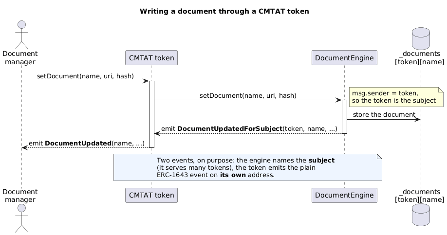
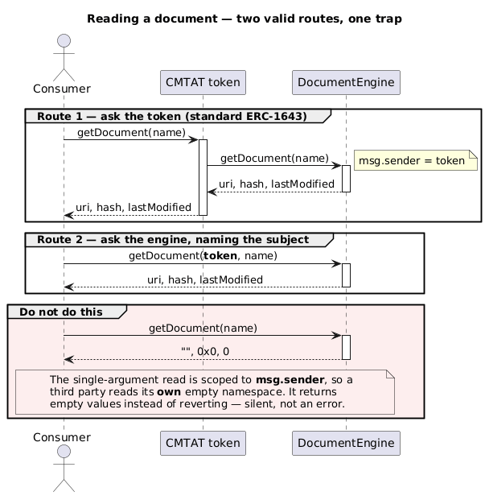

# DocumentEngine (ERC-1643)

A standalone contract that stores **[ERC-1643](https://github.com/ethereum/EIPs/issues/1643) documents on-chain on behalf of other contracts** — typically [CMTAT](https://github.com/CMTA/CMTAT) tokens. One engine serves a whole fleet: each subject gets its own namespace, keyed by its address, and can never reach another's.

A document is `{ string uri, bytes32 documentHash, uint256 lastModified }`, addressed by a `bytes32` name.

Why use an external engine rather than storing documents in the token:

- keeps the token's bytecode small;
- lets one operator manage documents for many tokens;
- documents can be updated without touching the token.

**Specification and full reference: [`doc/README.md`](./doc/README.md).**

> This project has not been audited yet, please use at your own risk. For any questions, please contact [admin@cmta.ch](mailto:admin@cmta.ch).

## Quick start

```bash
git clone --recurse-submodules https://github.com/CMTA/DocumentEngine
cd DocumentEngine
forge build
forge test
```

Requires [Foundry](https://getfoundry.sh) and Solidity `0.8.34` (`evm_version = prague`). Sources declare `pragma ^0.8.24`; building the tests needs `≥ 0.8.27`.

## Two ways to manage documents

Both are active at once.

**Admin path** — a document manager writes for *any* subject, passing the address explicitly:

```solidity
documentEngine.setDocument(address(token), name, uri, documentHash);
documentEngine.removeDocument(address(token), name);
```

**Bound-token path** — a *bound* token manages its **own** documents through the standard single-argument ERC-1643 functions (`msg.sender` is the subject):

```solidity
documentEngine.bindToken(address(token));   // once, by the document manager
// then, called by the token itself:
documentEngine.setDocument(name, uri, documentHash);
```

Binding is a single allowlist shared by both deployments — **not** a role.

## Two deployments

| Contract | Access control | Document management + binding restricted to |
| --- | --- | --- |
| `DocumentEngine` | `AccessControlEnumerable` | `DOCUMENT_MANAGER_ROLE` |
| `DocumentEngineOwnable` | `Ownable2Step` | `owner` |

They share all the logic (`DocumentEngineBase`, `TokenBindingModule`, `VersionModule`) and differ only in *who* is authorized. Authorization goes through an overridable `internal virtual` hook, so a subclass changes who may write without touching the management functions.

## Using it with a CMTAT token

Two independent steps, and it is easy to do only one: `bindToken` on the **engine** authorises the token, `setDocumentEngine` on the **token** tells it where to forward. Bind without wiring and the token has nowhere to send; wire without binding and the forwarded call reverts `NotBoundToken`.

```solidity
documentEngine.bindToken(address(token));   // engine's document manager
token.setDocumentEngine(documentEngine);    // token's document manager

token.setDocument(bytes32("prospectus"), "ipfs://...", keccak256(bytes(content)));
```

### Writing a document



### Reading a document



For the full flow — the wiring steps, every revert branch, and the admin path — see [the detailed sequence](./doc/README.md#integration-with-cmtat) in the documentation.

## Two things integrators must know

**Read through the subject, not the engine.** As the read diagram shows, the single-argument `getDocument(name)` is `msg.sender`-scoped, so a third party calling it on the engine reads *its own* — empty — namespace, with no revert. Read through the token, or use the address-scoped `getDocument(subject, name)`.

**The admin path emits nothing on the subject.** A write sent straight to the engine (`setDocument(subject, …)`, rather than through the token as above) has no execution point in the token, so only the engine's `DocumentUpdatedForSubject` fires. When consumers watch the token's address, use the bound-token path. Tracked as `OPEN-2` in [`doc/audits/AUDIT_OVERVIEW.md`](./doc/audits/AUDIT_OVERVIEW.md).

## Deploy

```bash
# role-based
DOCUMENT_ENGINE_ADMIN=0x… DOCUMENT_ENGINE_FORWARDER=0x… \
  forge script script/DeployDocumentEngine.s.sol --rpc-url $RPC_URL --broadcast

# owner-based
DOCUMENT_ENGINE_OWNER=0x… DOCUMENT_ENGINE_FORWARDER=0x… \
  forge script script/DeployDocumentEngineOwnable.s.sol --rpc-url $RPC_URL --broadcast
```

The forwarder enables ERC-2771 gasless calls and is **immutable**; pass `address(0)` to disable. Use a keystore or hardware wallet for real deployments, not a raw private key.

## More

| | |
| --- | --- |
| Specification / full reference | [`doc/README.md`](./doc/README.md) |
| Security overview & open items | [`doc/audits/AUDIT_OVERVIEW.md`](./doc/audits/AUDIT_OVERVIEW.md) |
| Static analysis & code-quality reports | [`doc/audits/tools/`](./doc/audits/tools) |
| Release history | [`CHANGELOG.md`](./CHANGELOG.md) |
| Reporting a vulnerability | [`SECURITY.md`](./SECURITY.md) |
| Diagrams (Surya, PlantUML) | [`doc/surya/`](./doc/surya), [`doc/img/`](./doc/img) |

## Compatibility

| DocumentEngine | Compatible CMTAT | Tested against |
| -------------- | ---------------- | -------------- |
| **v0.4.0** (current) | `v3.3.0-rc2` – `v3.3.0-rc3` | v3.3.0-rc3 |
| v0.3.0 and earlier | v2.5.0-rc0 | v2.5.0-rc0 |

The range is closed at both ends on purpose. CMTAT's `IERC1643` changed shape inside a single minor line — `getDocument` returns a `Document` struct up to `v3.3.0-rc1` and the three flat values from `v3.3.0-rc2` — so anything below rc2 does not compile, and a newer CMTAT is not assumed compatible until it has been tested. Full detail, including the Solidity and OpenZeppelin columns: [version compatibility](./doc/README.md#version-compatibility).

## Intellectual property

The code is copyright (c) Capital Market and Technology Association, 2018-2026, and is released under [Mozilla Public License 2.0](https://github.com/CMTA/CMTAT/blob/master/LICENSE.md).
