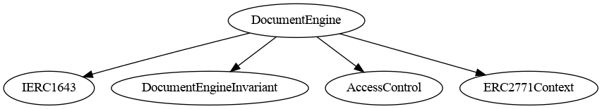
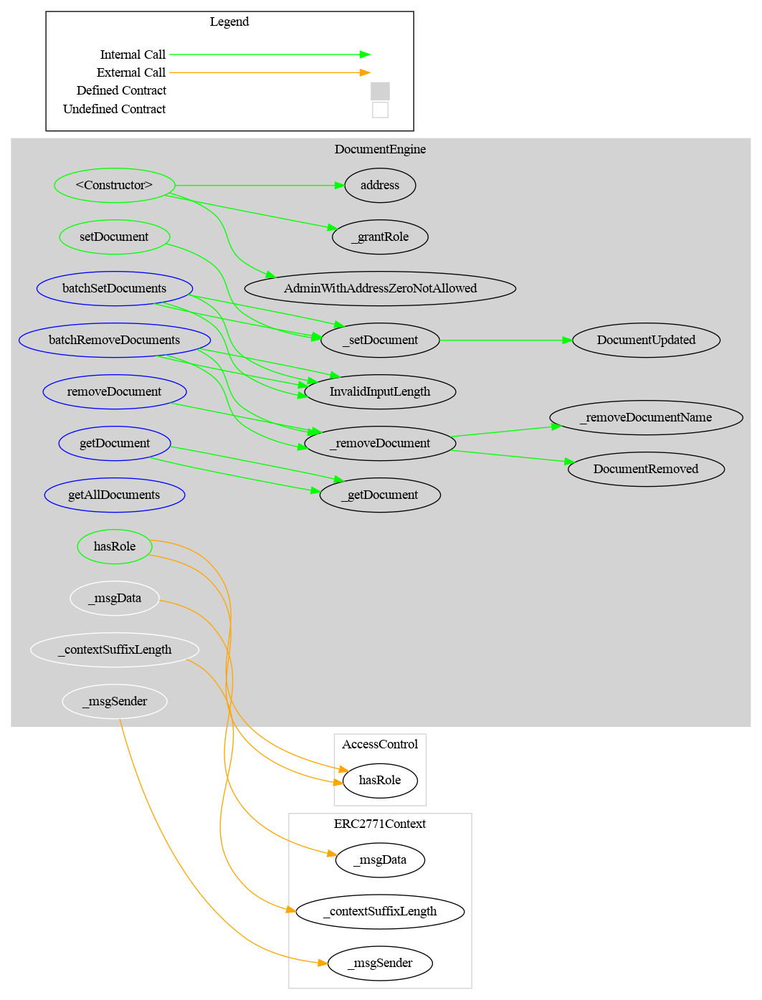

# DocumentEngine  (ERC-1643)

The `DocumentEngine` is an external contract to manage documents through [*ERC-1643*](https://github.com/ethereum/EIPs/issues/1643), a standard proposition to manage document on-chain. This standard is notably used by [ERC-1400](https://github.com/ethereum/eips/issues/1411) from Polymath. 

The documentEngine is planned to be used by other smart contract,e.g CMTAT token, to store documents on their behalf.

The ERC-1643 defines a document with three attributes:

- A short name (represented as a `bytes32`)
- A generic URI (represented as a `string`) that could point to a website or other document portal.
- The hash of the document contents associated with it on-chain.

A smart contract needs only to implement two functions from this standard, available in the interface [IERC1643](./contracts/interfaces/engined/draft-IERC1643.sol) to get the documents from the documentEngine.

```solidity
interface IERC1643 {
function getDocument(bytes32 _name) external view returns (string memory , bytes32, uint256);
function getAllDocuments() external view returns (bytes32[] memory);
}
```

Use an external contract for your smart contract provides two advantages: 

- Reduce code size of your smart contract
- Allow to manage documents for several different smart contracts

Warning:

Since this engine allows to set documents for several different smart contracts, the functions to set documents take one supplementary arguments than defined in the ERC-1643.

IERC1643

```bash
function setDocument(bytes32 _name, string _uri, bytes32 _documentHash) external;
```

DocumentEngine

```bash
function setDocument(address smartContract,bytes32 name_,string memory uri_, bytes32 documentHash_)
```


## Schema

### Inheritance




### Graph




## Surya Description Report


### Contracts Description Table


|      Contract      |         Type         |                      Bases                       |                |               |
| :----------------: | :------------------: | :----------------------------------------------: | :------------: | :-----------: |
|         └          |  **Function Name**   |                  **Visibility**                  | **Mutability** | **Modifiers** |
|                    |                      |                                                  |                |               |
| **DocumentEngine** |    Implementation    | IERC1643, DocumentEngineInvariant, AccessControl |                |               |
|         └          |    <Constructor>     |                     Public ❗️                     |       🛑        |      NO❗️      |
|         └          |     setDocument      |                     Public ❗️                     |       🛑        |   onlyRole    |
|         └          |    removeDocument    |                    External ❗️                    |       🛑        |   onlyRole    |
|         └          |  batchSetDocuments   |                    External ❗️                    |       🛑        |   onlyRole    |
|         └          | batchRemoveDocuments |                    External ❗️                    |       🛑        |   onlyRole    |
|         └          |     getDocument      |                    External ❗️                    |                |      NO❗️      |
|         └          |     getDocument      |                    External ❗️                    |                |      NO❗️      |
|         └          |   getAllDocuments    |                    External ❗️                    |                |      NO❗️      |
|         └          |   getAllDocuments    |                    External ❗️                    |                |      NO❗️      |
|         └          |     _getDocument     |                    Internal 🔒                    |                |               |
|         └          | _removeDocumentName  |                    Internal 🔒                    |       🛑        |               |
|         └          |   _removeDocument    |                    Internal 🔒                    |       🛑        |               |
|         └          |     _setDocument     |                    Internal 🔒                    |       🛑        |               |
|         └          |       hasRole        |                     Public ❗️                     |                |      NO❗️      |


### Legend

| Symbol | Meaning                   |
| :----: | ------------------------- |
|   🛑    | Function can modify state |
|   💵    | Function is payable       |

## Dependencies

The toolchain includes the following components, where the versions are the latest ones that we tested:

- Foundry
- Solidity 0.8.26 (via solc-js)
- OpenZeppelin Contracts (submodule) [v5.0.2](https://github.com/OpenZeppelin/openzeppelin-contracts/releases/tag/v5.0.2)
- Tests
  - [CMTAT v2.5.0-rc0](https://github.com/CMTA/CMTAT/releases/tag/v2.5.0-rc0)
  - OpenZeppelin Contracts Upgradeable(submodule) [v5.0.2](https://github.com/OpenZeppelin/openzeppelin-contracts-upgradeable/releases/tag/v5.0.2)

## Tools

### Forge coverage

```bash
forge coverage --report lcov && genhtml lcov.info --branch-coverage --output-dir coverage
```


### Prettier

```bash
npx prettier --write --plugin=prettier-plugin-solidity 'src/**/*.sol'
```


### Slither

```bash
slither .  --checklist --filter-paths "openzeppelin-contracts|test|CMTAT|forge-std" > slither-report.md
```

### Surya

See [./doc/script](./doc/script)


### Foundry

Foundry is a blazing fast, portable and modular toolkit for Ethereum application development written in Rust.

Foundry consists of:

-   **Forge**: Ethereum testing framework (like Truffle, Hardhat and DappTools).
-   **Cast**: Swiss army knife for interacting with EVM smart contracts, sending transactions and getting chain data.
-   **Anvil**: Local Ethereum node, akin to Ganache, Hardhat Network.
-   **Chisel**: Fast, utilitarian, and verbose solidity REPL.

### Documentation

https://book.getfoundry.sh/

### Usage

#### Build

```shell
$ forge build
```

#### Test

```shell
$ forge test
```

#### Format

```shell
$ forge fmt
```

### Gas Snapshots

```shell
$ forge snapshot
```

#### Anvil

```shell
$ anvil
```

#### Deploy

```shell
$ forge script script/Counter.s.sol:CounterScript --rpc-url <your_rpc_url> --private-key <your_private_key>
```

#### Cast

```shell
$ cast <subcommand>
```

#### Help

```shell
$ forge --help
$ anvil --help
$ cast --help
```
